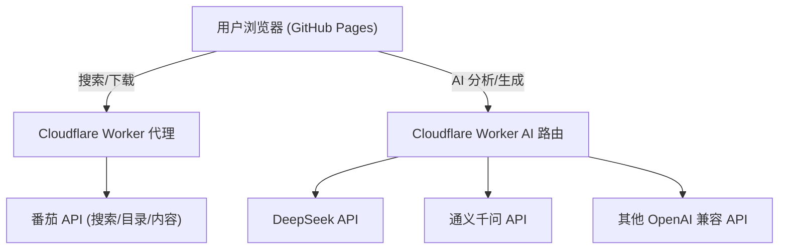

# AI 小说仿写生成器 - 技术设计

Feature: ai-novel-generator
Updated: 2026-07-01

## 描述

在现有番茄小说下载器基础上，增加 AI 分析 + 仿写功能。用户下载小说 → AI 分析风格 → AI 仿写生成新小说。支持多模型切换、全部免费部署。

## 架构



所有请求经过 Cloudflare Worker，Worker 负责:
1. 代理番茄 API（已实现）
2. 代理 AI API 请求，附加用户配置的 API Key
3. 处理大内容分段、流式输出

## 数据模型

### 模型配置 (localStorage)

```javascript
{
  models: [
    {
      id: "deepseek-v3",
      name: "DeepSeek V3",
      endpoint: "https://api.deepseek.com/v1/chat/completions",
      apiKey: "sk-xxx"
    }
  ],
  activeModel: "deepseek-v3"
}
```

### 风格画像 (客户端内存)

```javascript
{
  sourceTitle: "诡舍",
  sourceChapterCount: 5,
  analyzedChapters: 5,
  styleProfile: {
    narrative: "第三人称有限视角...",
    sentenceStyle: "短句为主，平均15字...",
    vocabulary: "偏好悬疑类词汇...",
    dialogueStyle: "对话紧凑，占比约40%...",
    pace: "章节开头慢速铺垫，中段加速...",
    sceneDescription: "环境描写细腻，多用感官描述..."
  }
}
```

### 仿写设定 (客户端内存)

```javascript
{
  genre: "悬疑",
  protagonist: "林晚，26岁，私家侦探",
  worldSetting: "现代都市，隐藏超自然元素",
  outline: "主角接到一桩离奇失踪案...",
  chapterCount: 3
}
```

## 组件和接口

### 前端组件 (纯 HTML/JS，零框架依赖)

| 组件 | 功能 | 状态 |
|------|------|------|
| 搜索区 | 书名搜索 / 链接解析 | 已有 |
| 下载区 | 进度条、暂停/继续/保存 | 已有 |
| 模型配置面板 | CRUD 模型配置 | 新增 |
| AI 分析区 | 发送分析请求、显示进度和结果 | 新增 |
| AI 生成区 | 填写设定、生成章节、阅读和保存 | 新增 |
| 步骤导航 | 四个阶段的进度指示器 | 新增 |

### Cloudflare Worker API 路由

所有接口在现有 `proxy-worker.js` 中扩展:

```
GET  /api/search?q=xxx          → 搜索（已有）
GET  /api/directory?bookId=xxx  → 目录（已有）
GET  /api/content?itemId=xxx    → 内容（已有）
GET  /api/download/*            → 下载管理（已有）

POST /api/ai/analyze            → AI 风格分析（新增）
POST /api/ai/generate           → AI 仿写生成（新增）
POST /api/ai/chat               → AI 通用对话（新增）
```

### AI 接口详情

**POST /api/ai/analyze**

```javascript
// 请求
{
  endpoint: "https://api.deepseek.com/v1/chat/completions",
  apiKey: "sk-xxx",
  model: "deepseek-chat",
  chunks: ["第1章内容...", "第2章内容...", "第3章内容..."],
  options: { temperature: 0.3, max_tokens: 4096 }
}

// 响应 (SSE 流式)
data: {"type":"progress","current":1,"total":3}
data: {"type":"partial","text":"叙事视角分析："}
data: {"type":"result","styleProfile":{...}}
```

**POST /api/ai/generate**

```javascript
// 请求
{
  endpoint: "https://api.deepseek.com/v1/chat/completions",
  apiKey: "sk-xxx",
  model: "deepseek-chat",
  styleProfile: {...},
  settings: {
    genre: "悬疑",
    protagonist: "林晚，26岁，私家侦探",
    worldSetting: "现代都市...",
    outline: "主角接到一桩离奇失踪案...",
    chapterCount: 3
  },
  options: { temperature: 0.8, max_tokens: 8192 }
}

// 响应 (SSE 流式)
data: {"type":"chapter","index":1,"title":"第一章 失踪"}
data: {"type":"content","text":"深夜的雨..."}
data: {"type":"chapter_end","index":1}
```

## 自由部署方案

| 层 | 平台 | 免费额度 | 用途 |
|----|------|---------|------|
| 前端 | GitHub Pages | 无限 | 静态页面托管 |
| 后端代理 | Cloudflare Workers | 10万次/天 | 番茄 API 代理 + AI API 代理 |
| 内容 API | 101.35.133.34:5000 | 第三方 | 完整章节内容（已有） |
| AI 推理 | DeepSeek / 通义千问等 | 各平台新用户赠送额度 | 风格分析 + 生成 |
| 存储 | localStorage | 浏览器本地 | 模型配置、生成历史 |

**不额外需要数据库的原因**:
- 小说内容仅用于 AI 分析，无需持久化
- 模型配置存 localStorage，隐私安全
- 生成结果支持下载 TXT 保存到本地
- 没有多用户、同步需求

## Prompt 设计

### 分析 Prompt

```
你是一位专业的小说分析家。请分析以下小说的写作风格特征。

请从以下维度输出结构化分析：
1. 叙事视角：第一人称/第三人称/全知/有限？具体表现？
2. 句式特征：平均句长、常用句型、修辞手法偏好
3. 词汇偏好：高频词汇、特色用词、方言或网络用语倾向
4. 对话风格：对话占比、对话节奏、人物语言差异
5. 节奏模式：信息密度变化、悬念设置方式、过渡技巧
6. 场景描写：环境描写的详细程度、感官维度偏好

小说内容分批发送，请在每个维度分析完成后标记 [完成]。

小说内容：
{content}
```

### 生成 Prompt

```
请根据以下风格画像和创作设定，创作一篇新小说。

【风格要求】
叙事视角: {narrative}
句式特征: {sentenceStyle}
词汇偏好: {vocabulary}
对话风格: {dialogueStyle}
节奏模式: {pace}
场景描写: {sceneDescription}

【创作设定】
题材: {genre}
主角: {protagonist}
世界观: {worldSetting}
故事梗概: {outline}

请生成 {chapterCount} 章，每章 1500-3000 字，遵循上述风格要求。直接开始创作，输出格式：
第X章 章节标题
（正文）
```

## 错误处理

| 场景 | 处理方式 |
|------|---------|
| AI API Key 无效 | 提示用户检查配置 |
| AI 接口超时 | 降低分段大小，最多重试 3 次 |
| 内容超上下文限制 | 自动分段至合理大小（约 2000 字/段） |
| Worker 超时 (30s 限制) | 使用分块返回 + 前端轮询，长任务拆分为多次请求 |
| 用户断网 | 恢复后断点续传（localStorage 缓存进度） |

## 关键约束

1. API Key 仅在请求时传递到 Worker，不存储在 Worker 或 GitHub Pages 中
2. 小说内容仅存在于浏览器内存，分析完成后释放
3. Cloudflare Workers 免费版单次执行限制 30 秒，长内容分多次请求完成
4. 不收集任何用户数据，完全在客户端处理

## 文件结构

```
workspace/
├── proxy-worker.js          # Cloudflare Worker (扩展 AI 路由)
├── docs/
│   └── index.html           # 前端 (扩展 AI 界面)
├── userscript/
│   └── fanqie.user.js       # 油猴脚本 (不变)
└── web-tool/
    ├── server.py            # 本地 Python 后端
    └── index.html           # 本地版前端
```
